```{r setup, include=FALSE}
options(htmltools.dir.version = FALSE)
library(kableExtra)
```


```{r xaringan-themer, include=FALSE, warning=FALSE}
library(xaringanthemer)
style_mono_accent(
  base_color = "#1c5253",
  header_font_google = google_font("Josefin Sans"),
  text_font_google   = google_font("Montserrat", "300", "300i"),
  code_font_google   = google_font("Fira Mono")
)
#.center[<span style="color:coral">**Quality of proxy information matters.**</span>]
```

## Acknowledgement

.large[

- Funding
    - BC SUPPORT Unit 
    - NSERC

- Joint work with 
    - **Lucy Mosquera** (Statistics)
    - **Md. Belal Hossain** (Population and Public Health)
]

---

# Outline

.large[

.center[Slides at [ehsanx.github.io/IPAW-slides/](https://ehsanx.github.io/IPAW-slides/)]

1. Lipid trial

  - Adherence adjustment methods

  - Understanding Lipid trial results

  - Literature

2. Simulation and results

3. Interpreting Lipid trial results

4. Follow-up work and future directions

]

---

## Lipid trial

.large[

- Time to event outcome:
      - coronary heart disease (CHD) death or
      - non-fatal myocardial infarction

- Exposure: 
      - cholestyramine or
      - placebo

- Population: 
      - people with very high levels of LDL cholesterol,
      - 35-59 years aged, 
      - initially free of CHD,
      - recruited between mid-1973 and mid-1976.
      

]

---


## Lipid trial 

.large[

- 2-armed double-blind RCT
      - $3,550$ subjects eligible
      - randomized at 5th visit and 
      - followed $\ge 7$ years

- Static treatment regime

- Medication adherence 
      - counts of unused medication packets
      - satisfactory adherence as $\ge 80\%$
      - $84.0\%$ in the treatment arm were nonadherent
      - $77.2\%$ in the placebo arm.

]

---

## Lipid trial 


.large[
*Baseline prognostic factors* (.red[**B**])

- baseline risk strata (ECG, LDL, smoking etc.), 
- age at randomization, 
- physical activity level at work at baseline, 
- educational status, and 
- race.

*Post-randomization prognostic factors* (.red[**L**])

- 38 time-varying covariates
]


---

## Adherence adjustment methods
.pull-left[
.large[**Intention to Treat (ITT)**]

- compares randomized to treatment arm vs. control arm
- no adherence adjustment
]


.pull-right[
.large[**Naive Per-protocol (Naive PP)**]

- artificially censoring when become non-adherent 
- no covariate adjustment
- alternate version exlcudes patients
]

.pull-left[
.large[**Conditional Per-protocol (Adj. PP)**]

- B adjusted PP
- L adjusted PP
- B+L adjusted PP
]

.pull-right[
.large[**IP of (Adherence) Weighted Per-protocol (sIPW PP)**]

- IP Weights adjust for bias introduced by artificially censoring
- L adjusted in IP weights
- B adjusted in weighted outcome model
- uIPW is another version with unstabilized weights
]

---

.large[
**Treatment effect estimates**
]

```{r echo=FALSE, out.width='120%', fig.align="center"}
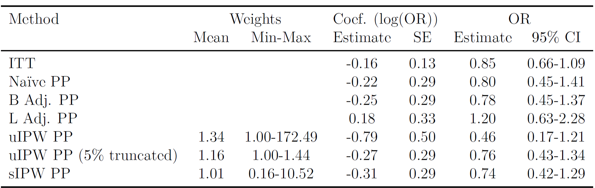
```

.large[
- true DAG unknown 
- unknown whether all adherence predicting factors were measured
- finite sample size: $3,550$
- high non-adherence rate 
- differential non-adherence: $84\%$ vs. $77.2\%$
- low event rate: $7.3\%$ 
- measurement schedule varied 
- LOCF was used for imputation 

]

---

## Literature search about IPW 

.large[
- Robins and Finkelstein (2000): 
    - asymptotic consistent if model correctly specified
    
- Hernan and Robins (2017), Murray and Hernan (2016, 2018):
    - Reanalysis; addressing treatment-confounder feedback

- Morden et al. (2011), Latimer et al. (2017, 2018)  
    - estimates sensitive to switching proportions
    
- Young et al. (2019): 
    - interval censoring simulation framework
    - 200K, 1 DAG, null treatment effect, differing measurement schedule, varying confounding
  
]

---

## New Simulations

**B affects A and Y directly**: 

*Diag 1(i)*: A affects subsequent L


```{r echo=FALSE, out.width='70%', fig.align="center"}
knitr::include_graphics('images/mainDAG.png')
```

*Diag 1(ii)*: A does not affect subsequent L

```{r echo=FALSE, out.width='70%', fig.align="center"}
knitr::include_graphics('images/mainDAG8.png')
```

---


## New Simulations

**B affects Y directly, but affects A indirectly via L**: 

*Diag 2(i)*: A affects subsequent L


```{r echo=FALSE, out.width='70%', fig.align="center"}
knitr::include_graphics('images/mainDAG2.png')
```

*Diag 2(ii)*: A does not affect subsequent L

```{r echo=FALSE, out.width='70%', fig.align="center"}
knitr::include_graphics('images/mainDAG5.png')
```

---

## New Simulations

**B affects A and Y directly, but not A**: 

*Diag 3(i)*: A affects subsequent L


```{r echo=FALSE, out.width='70%', fig.align="center"}
knitr::include_graphics('images/mainDAG3.png')
```

*Diag 3(ii)*: A does not affect subsequent L

```{r echo=FALSE, out.width='70%', fig.align="center"}
knitr::include_graphics('images/mainDAG4.png')
```

---

## New Simulations

**B does not affect A or Y**: 

*Diag 4(i)*: A affects subsequent L


```{r echo=FALSE, out.width='70%', fig.align="center"}
knitr::include_graphics('images/mainDAG7.png')
```

*Diag 4(ii)*: A does not affect subsequent L

```{r echo=FALSE, out.width='70%', fig.align="center"}
knitr::include_graphics('images/mainDAG6.png')
```


---
class: full-slide-fig, center

## All 8 DAGs

```{r echo=FALSE, out.width='110%', fig.align="center"}
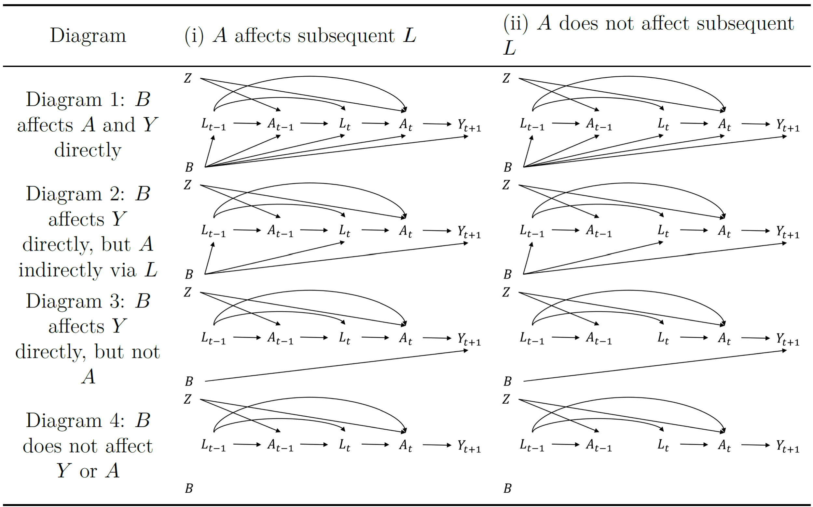
```


---

class: full-slide-fig, center

.large[**Bias for different DAGs**]

| <div style="width:290px">Naive estimates</div> | <div style="width:290px">B is measured </div>| <div style="width:290px">B is not measured </div>|
|---------------------------|---------------------------|---------------------------|

```{r echo=FALSE, out.width='150%', fig.align="center"}
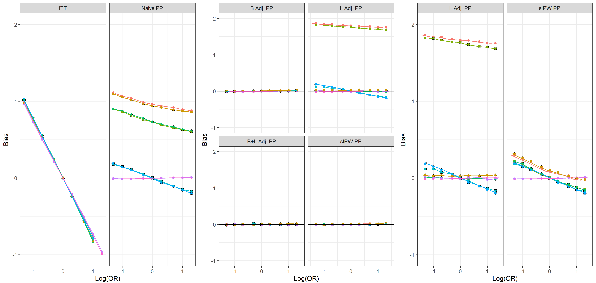
```
```{r echo=FALSE, out.width='50%', fig.align="center"}
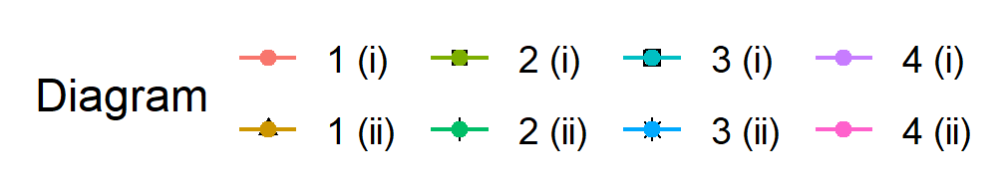
```

---

class: full-slide-fig, center

.large[**Coverage and MSE when B not measured**]

```{r echo=FALSE, out.width='60%', fig.align="center"}
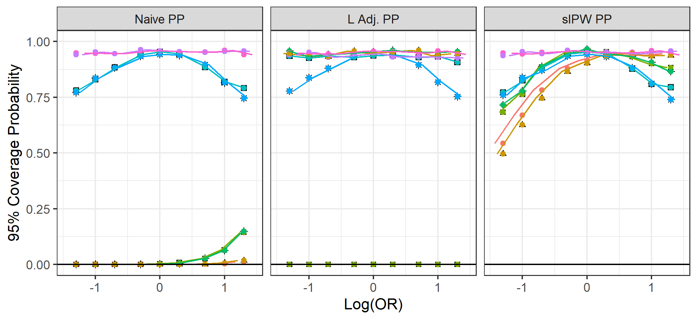
```
```{r echo=FALSE, out.width='50%', fig.align="center"}

```

---

class: full-slide-fig, center, middle

.large[**Bias and SE with increasing non-adherence** 

- .red[B is measured] in DAG 1(i)
]

```{r echo=FALSE, out.width='100%', fig.align="center"}
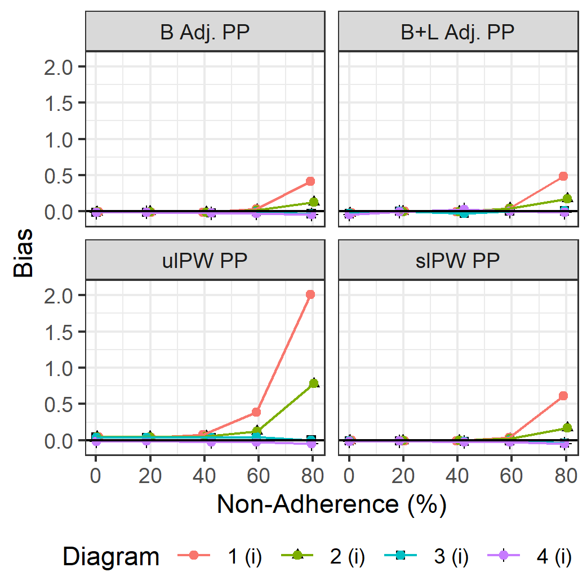
```

---

class: full-slide-fig, center, middle

.large[**Bias and SE with increasing non-adherence**

- Differential non-adherence
- .red[B is measured] in DAG 1(i)
]

```{r echo=FALSE, out.width='100%', fig.align="center"}
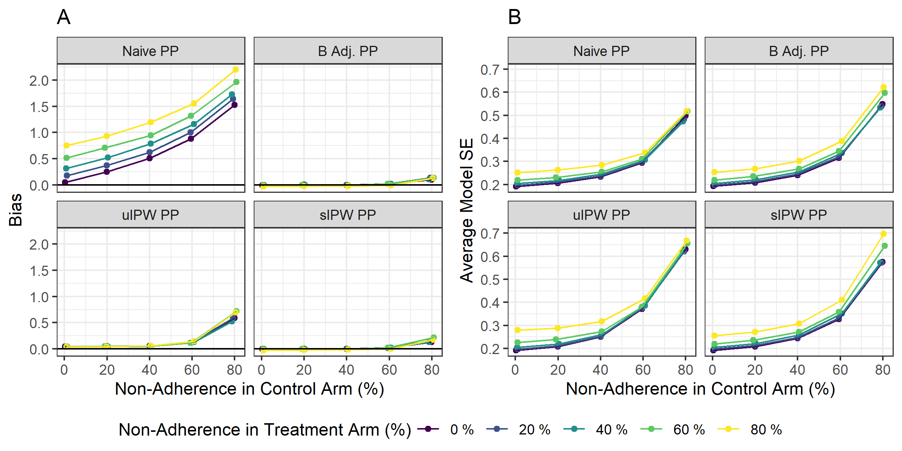
```

---

class: full-slide-fig, center, middle

.large[**Bias and SE with increasing non-adherence** 

- Differential non-adherence
- .red[B is not measured] in DAG 1(i)
]

```{r echo=FALSE, out.width='100%', fig.align="center"}
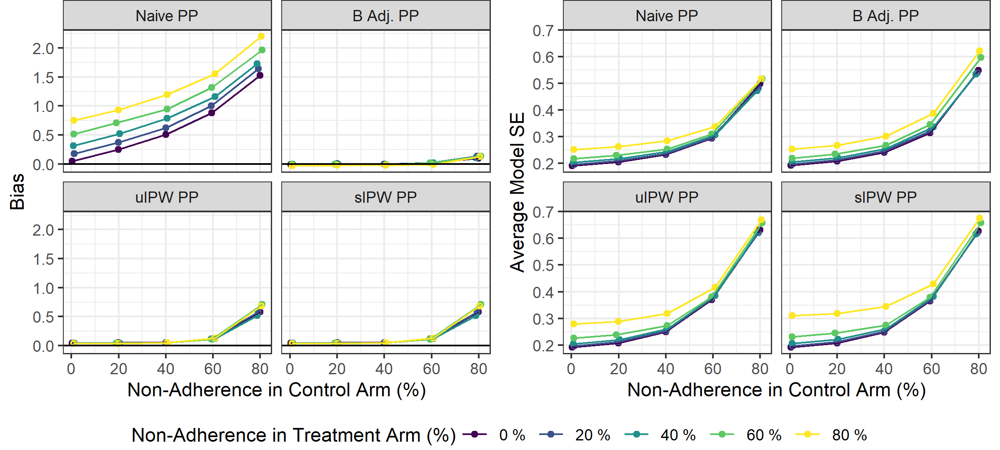
```

---


class: full-slide-fig, center, middle

.large[**Bias and SE with increasing event rate** 

- .red[B is measured] in DAG 1(i) from model-based estimates
- .red[Cumulative survival based estimates] were associated with non-convergence

]

```{r echo=FALSE, out.width='70%', fig.align="center"}
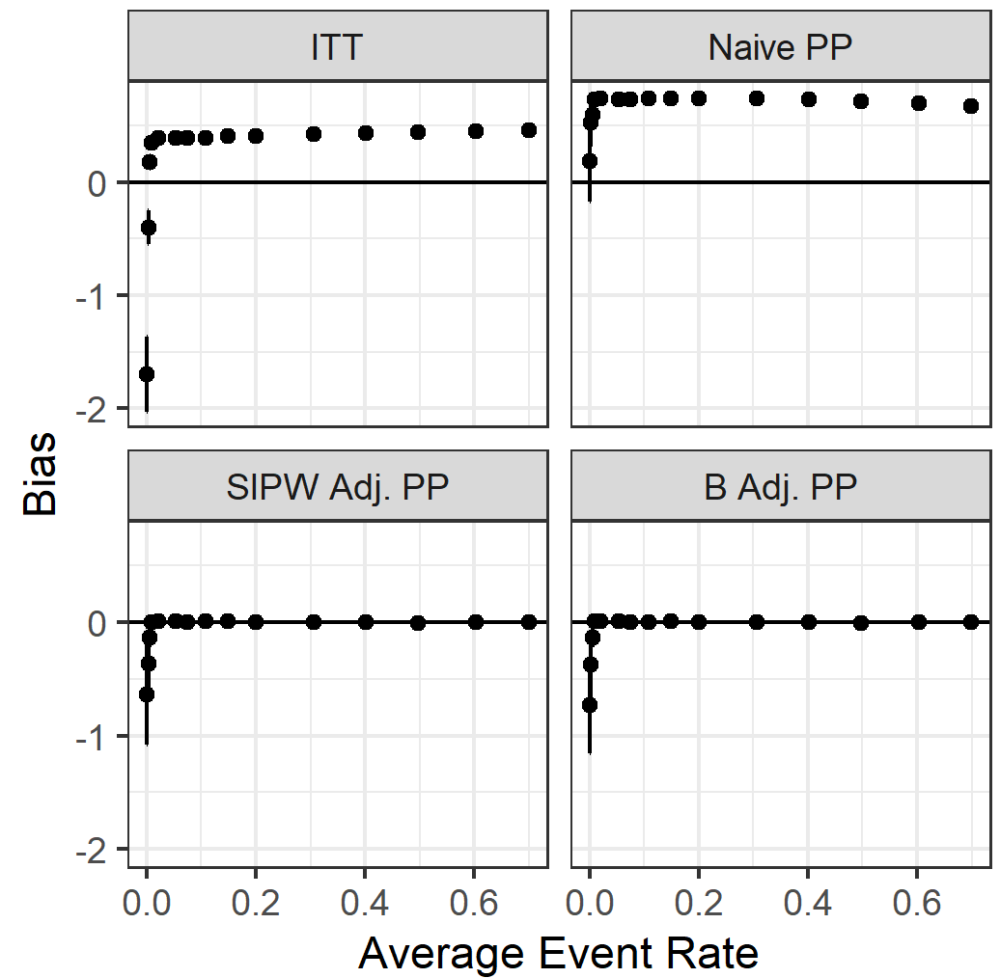
```

---

class: full-slide-fig, center, middle

.large[**Bias with decreasing measurement frequency** 

- .red[B is measured] in DAG 1(i)
- A and L imputed with LOCF

]

```{r echo=FALSE, out.width='35%', fig.align="center"}
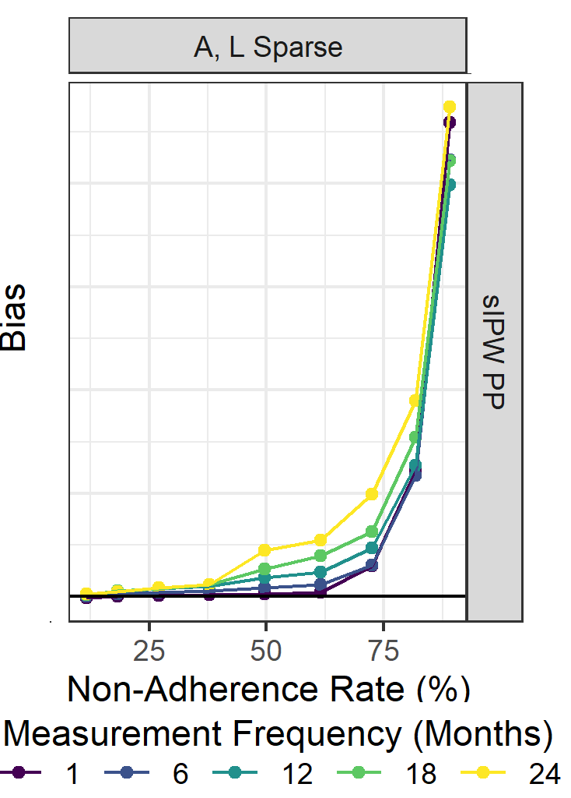
```


---
.large[
**Treatment effect estimates**
]


```{r echo=FALSE, out.width='110%', fig.align="center"}

```

.large[
- true DAG unknown (.red[Somewhat resembles with DAG 1 or 2 (i)])
- unknown whether all adherence predicting factors were measured (.red[sIPW])
- finite sample size: 3,550 (.red[over 1000 is OK])
- high non-adherence rate (.red[slightly more biased above 60%])
- differential non-adherence (.red[slightly more biased; same trend])
- low event rate: $7.3\%$ (.red[above 1% was OK for model-based])
- measurement schedule varied (.red[upward bias above 40% n-ad])
- LOCF was used for imputation (.red[variance of most SD < 2])
]


---

class: full-slide-fig, center, middle

## Recently published article


```{r echo=FALSE, out.width='90%', fig.align="center"}
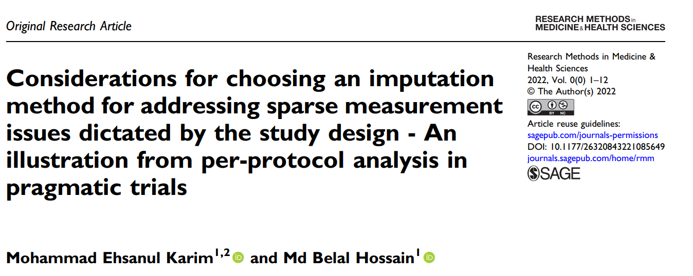
```

---


class: full-slide-fig, center, middle

.large[**Coverage with decreasing measurement frequency** 

- .red[B is measured] in DAG 1(i); null effect
- L imputed with LOCF and MI; .red[MCAR]

]

```{r echo=FALSE, out.width='55%', fig.align="center"}
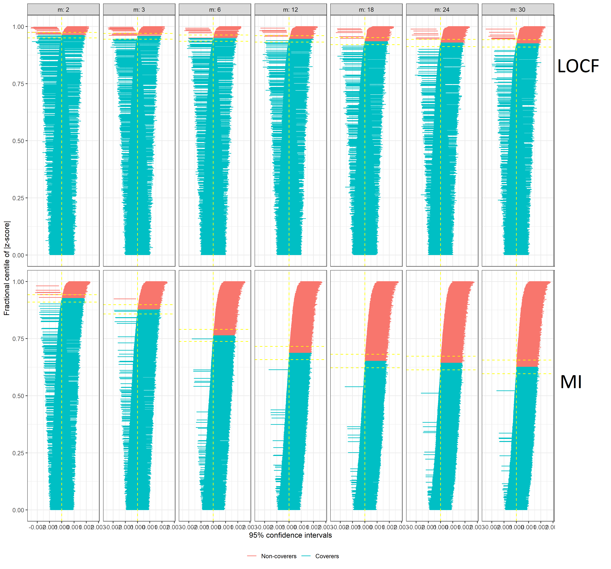
```

---

class: full-slide-fig, center, middle

.large[**Coverage with decreasing measurement frequency** 

- .red[B is not measured] in DAG 1(i); null effect
- L imputed with LOCF and MI; .red[MCAR]

]

```{r echo=FALSE, out.width='55%', fig.align="center"}
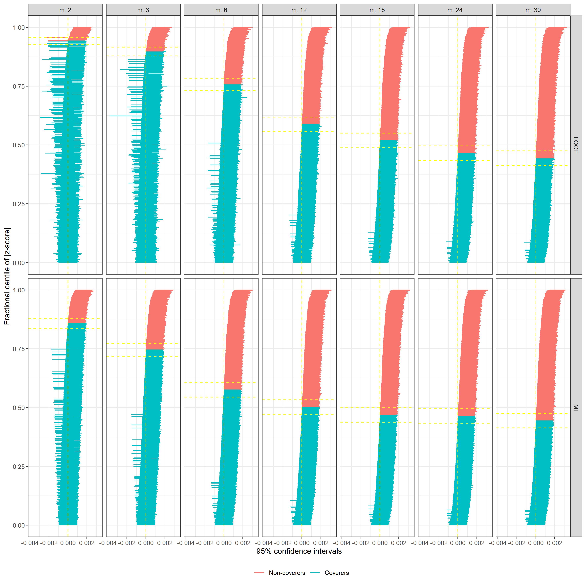
```

---


## Future works

.large[

- Compare sIPW per-protocol estimates:
    - interval censored versus $80\%$ cutpoint

- Double robust version to address model mis-specification

]
---

class: center, middle

# Thanks!

### http://ehsank.com/